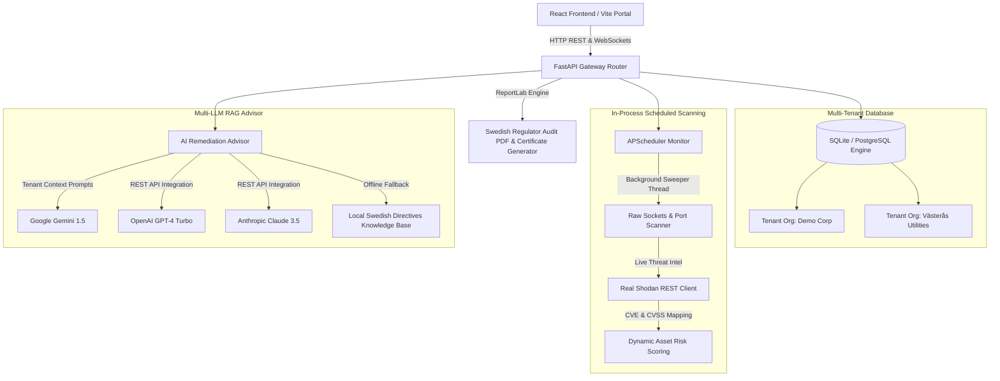

# 🛡️ NIS2 CyberShield Compliance & AI Remediation Platform

An enterprise-grade, multi-tenant SaaS cybersecurity platform designed to automate network asset discovery, map systems to Swedish **NIS2 Scope Criteria**, calculate legal gap scores against the **NIS2 Directive (Article 21)**, compile formal audit PDFs for the **Swedish Civil Contingencies Agency (MSB / NCSC-SE)**, and provide real-time plain-language remediation instructions via multiple LLM integrations.

---

## 🏗️ Core SaaS Architecture Blueprint



---

## 🌟 Premium Enterprise Features

### 1. Multi-Tenant SaaS Scoping
The platform is built from the ground up to support multiple distinct client environments (organizations). All parameters, including network assets, gap analysis scores, system credentials, and scheduling, are isolated and scoped per `organization_id`.

### 2. In-Process Background Scheduled Scanning (No Redis / Celery required!)
For standard and free tier deployments, the platform runs background continuous monitoring rescans directly in-process utilizing an active `BackgroundScheduler`. This completely eliminates the need for expensive Celery and Redis container services, allowing the entire application to boot inside a single container or developer machine.

### 3. Dynamic HSL Risk Scoring Formula
Rather than hardcoding risk tags, the scanner runs a continuous mathematical calculation:
$$\text{Asset Risk Score} = \text{Open Port Count} \times \text{Max Discovered CVSS Vulnerability} \times \text{NIS2 Sector Weight}$$
Sectors are weighted according to Swedish national critical lists (e.g., Energy and Health receive a `1.5` coefficient, whereas Chemicals receive `1.2`).

### 4. Real Shodan API CVE Footprinting
Hook up your free Shodan developer key to query live threat telemetry. Discovered IP hosts automatically resolve exposed CVE lists alongside high-fidelity NVD CVSS ratings.

### 5. Auditor Evidence Uploads
Auditors can upload PDF policies, configurations, or screenshots directly against individual Article 21 requirements. Telemetry tracks files per tenant under a secure static path with dynamic browser download links.

### 6. Remediation Kanban Task Board
Bridging the gap between auditing and engineering. CISOs can instantly transform identified compliance gaps into interactive tickets (featuring assignees, deadlines, and active columns).

### 7. Dated NIS2 Readiness Certificate Generator
Whenever your organization's overall compliance maturity score hits $\ge 80\%$, the ReportLab compiler appends a dated formal **NIS2 Compliance Readiness Certificate** featuring gold-accent frames, security stamps, and digital hashes.

---

## 📁 Repository Directory Layout

```text
NIS2/
├── backend/
│   ├── app/
│   │   ├── templates/          # Single-file standalone HTML backup portal
│   │   ├── advisor.py          # Multi-LLM REST routing & local RAG fallback
│   │   ├── config.py           # Configuration Settings Loader
│   │   ├── database.py         # DB Engine Setup
│   │   ├── gap_analysis.py     # Article 21 scoring & Slack alerts hook
│   │   ├── main.py             # FastAPI App Lifespans and WebSocket Server
│   │   ├── models.py           # Multi-tenant SQL Tables Schemas
│   │   ├── reporter.py         # ReportLab Audit PDF & Certificate Compiler
│   │   ├── scanner.py          # Port Sweep & CVE/CVSS threat calculators
│   │   ├── schemas.py          # Pydantic Serializers
│   │   └── scheduler.py        # In-process scheduled monitors
│   └── Dockerfile              # Backend container recipe
├── frontend/                   # Modern React Visual UI
│   ├── src/
│   │   ├── components/
│   │   │   ├── AIAdvisor.jsx   # AI conversational chat panels
│   │   │   ├── AssetScanner.jsx# Active scans forms & WebSocket console
│   │   │   ├── Dashboard.jsx   # Compliance meters & Recharts history
│   │   │   ├── GapMatrix.jsx   # Interactive sliders & Evidence uploads
│   │   │   ├── Settings.jsx    # Multi-LLM provider credential sliders
│   │   │   └── RemediationBoard.jsx # Interactive Kanban tasks tracker
│   │   ├── App.jsx             # React master router and state coordinator
│   │   ├── index.css           # Custom typography & glassmorphism theme
│   │   └── main.jsx
│   ├── index.html
│   ├── package.json
│   └── vite.config.js
├── tests/                      # Testing Suite
│   └── test_platform.py        # 11 rigorous sandbox unit/integration tests
├── .env.example                # Sample environment configurations template
├── .gitignore                  # Python Git ignores
├── docker-compose.yml          # Optional Postgres production compose
├── README.md                   # Visual architecture handbook
├── requirements.txt            # Python dependencies
└── run.py                      # Automated developer launcher
```

---

## ⚡ Quick Start Developer Setup (Fastest Path)

We have created an **automated launcher** that analyzes your local environment, installs dependencies, handles SQLite seeding, and initializes active schedules:

```bash
# 1. Navigate to directory
cd NIS2

# 2. Boot launcher
python run.py
```
The launcher will instantly start the server and load:
*   **FastAPI Backend Server:** [http://localhost:8000](http://localhost:8000) (Serves standalone backup portal)
*   **Interactive Swagger API Docs:** [http://localhost:8000/docs](http://localhost:8000/docs)

### Booting the Modern React Visual UI:
```bash
# 1. Navigate into frontend
cd frontend

# 2. Install packages
npm install

# 3. Boot Vite development server
npm run dev
```
Open **[http://localhost:5173](http://localhost:5173)** in your browser to view the high-end responsive glassmorphism dark-theme dashboard.

---

## 🇸🇪 Swedish Incident Notification Timelines (MSB / NCSC-SE)

The platform's **AI Advisor** is customized to output regulatory-aligned schedules in accordance with MSB implementation acts:

1.  **Early Warning (24 Hours):** Submit a brief initial report via `cert.se` regarding suspected malicious activities.
2.  **Incident Notification (72 Hours):** Formal assessment containing precise impact statistics.
3.  **Final Report (1 Month):** Rigorous analysis documenting root-cause findings and patches applied.
